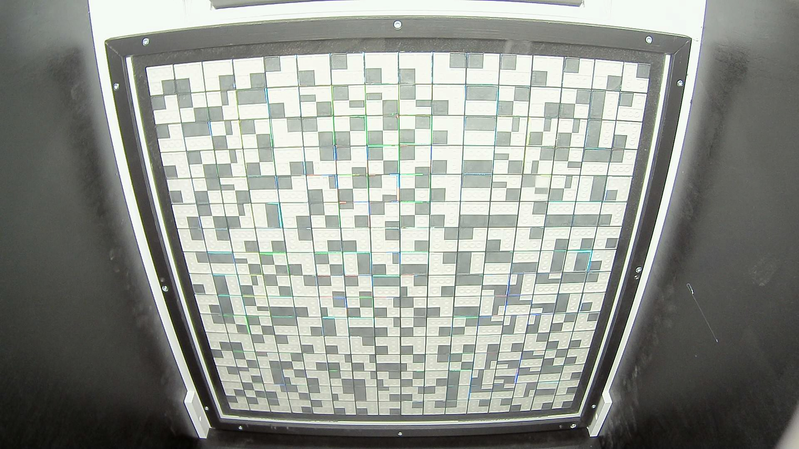
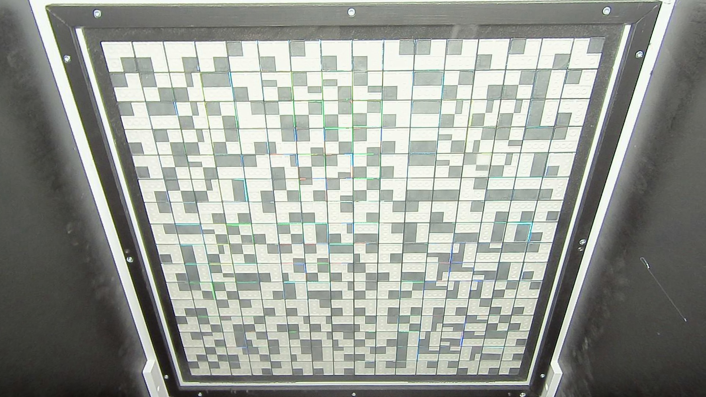
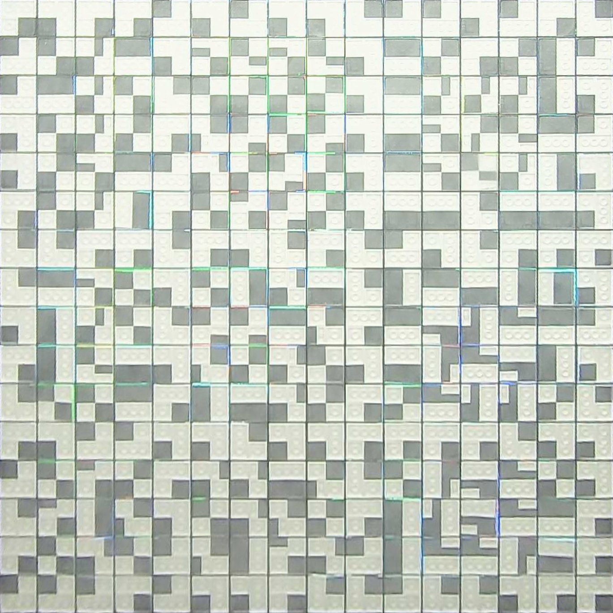
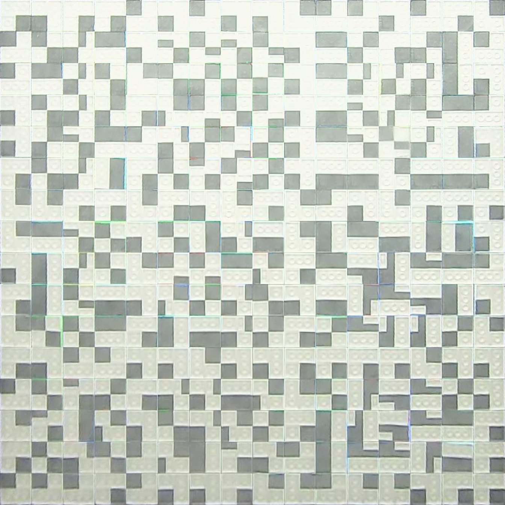
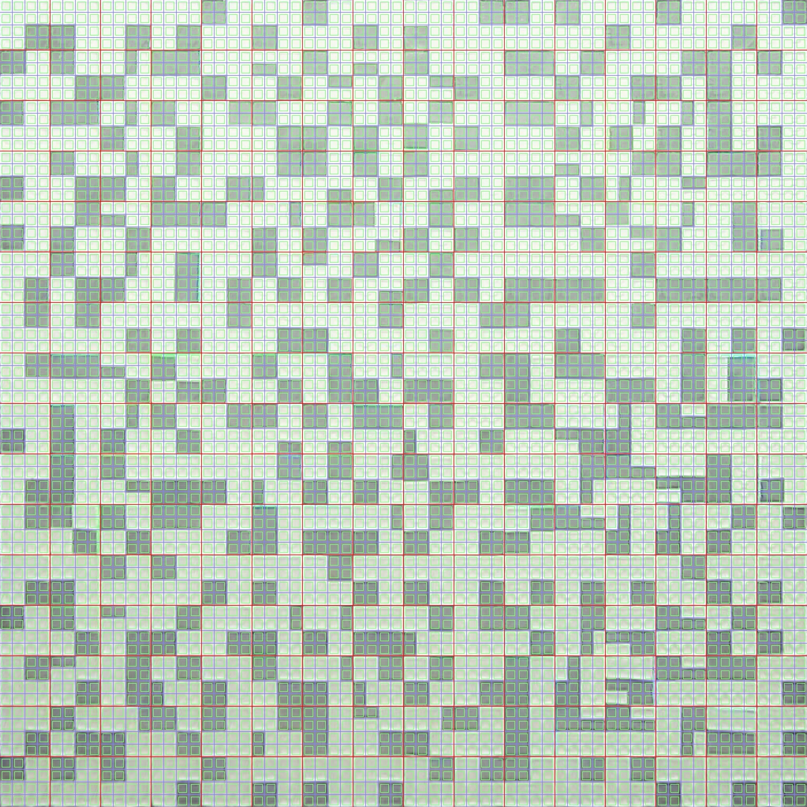
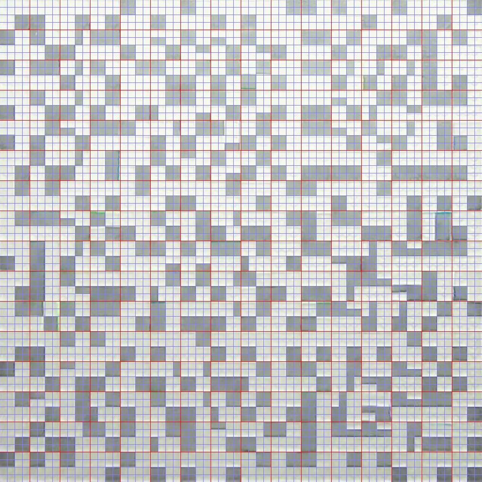
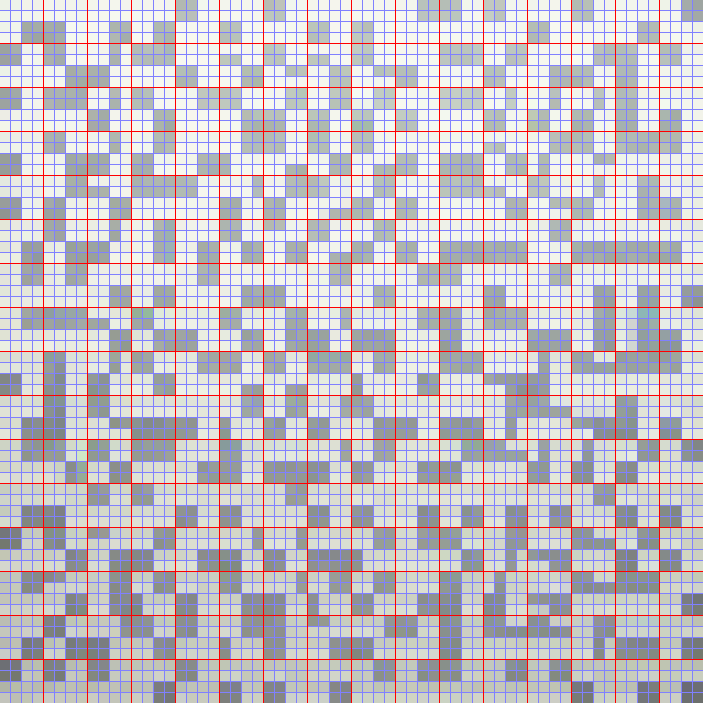
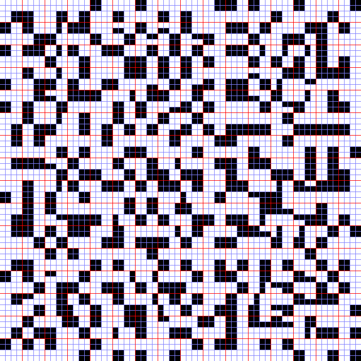

# Processing Pipeline

The `tag-grid-scanner` performs a series of image processing steps to determine which tags are visible in the image
retrieved from the camera.

For the examples below, the `tag-grid-scanner` is configured with the following file:

```YAML
camera:
  id: 0
  size: [ 1920, 1080 ]
  fps: 30
  fourcc: MJPG
  calibration: # ELP USB3MP01H 1920x1080 2.9mm
    matrix: [ [ 0.6834898667393322, 0.0, 0.4965583739104512 ], [ 0.0, 1.216452331944533, 0.5026849121434522 ], [ 0.0, 0.0, 1.0 ] ]
    distortion: [ -0.3714812399536999, 0.21247979505344064, -0.00020619953391510647, -0.0009202007819819389, -0.08640239614978638 ]
dimensions:
  grid: [ 16, 16 ]
  tile: [ 4, 4 ]
  roi: [
    [ 0.144010415, 0.10810184814814817 ],
    [ 0.8569010383333333, 0.09699073962962965 ],
    [ 0.7333333283333334, 0.9428240711111113 ],
    [ 0.27135416166666665, 0.9451388888888889 ]
  ]
  gap: [ 0.0036, 0.0036 ]
  crop: [ 0.65, 0.65 ]
tags:
  unknown: 0   # Generic property for all tiles that do not match any tag
  # Tag representation:
  # - 0 repersents a black pixel
  # - 1 represents a white pixel
  # - the pixels are enumerated
  #  * line by line
  #  * from left to right
  #  * starting in the top left corner
  '1100110011111111': 1
  '1100110000110011': 5
  '1100110011001100': 6
  '1100110001110111': 2
  '1100110010111011': 3
  '1100110011011101': 4
notify:
  template: { }
  assignTo: /cells
  flipH: true
  rotate: 180
```

## Grab an image from the webcam

This is the unprocessed image from the webcam.



[Code](../taggridscanner/pipeline/retrieve_image.py)

## Correct the lens distortion

Most lenses introduce some optical distortion. If this distortion isn't automatically corrected by the camera, it needs
to be corrected in software to proceed. Wide-angle lenses often introduce more distortion than telephoto lenses.

The `tag-grid-scanner` can correct barrel and pincushion distortion given proper calibration.

In addition, this preprocessing step also allows flipping and rotating the image (not shown in the example image). This
is useful if the camera looks at the grid in a way that does not match the grid shape or tag definition, e.g. the camera
is rotated or sees a mirror image of the grid.



[Code](../taggridscanner/pipeline/preprocess.py)

## Extract the region of interest from the distortion-corrected image

The image usually contains a lot more than just the tag grid itself. If the camera viewing direction isn't perfectly
orthogonal to the grid, the grid will not appear as a rectangle im the image, but rather as a non-rectangular
quadrilateral due to perspective distortion.

This step of the processing pipeline computes a homography between the vertices of the region of interest and a
rectangle that has the same aspect ratio as the grid. The lengths of the sides of the rectangle are determined by the
length of the sides of the region of interest such that no side will be shortened.

Given the homography matrix, extraction of the region of interest and perspective correction is done in one step.



[Code](../taggridscanner/pipeline/extract_roi.py)

## Remove the gaps between the tiles

If there are gaps between the tiles, they are removed in this step. The gap removal is performed at sub-pixel accuracy
and results in the tiles having integer dimensions and all tiles being the same size. This improves the detection
quality when the resolution is low at the expense of a slightly higher processing time.



[Code](../taggridscanner/pipeline/remove_gaps.py)

## Crop the tile cells

Because the alignment of the tags is not always perfect with the grid, the outer region of each tile's cell can and
should be cropped.

This pipeline step extracts the green area in the first image below. The result in shown in the second image. Note that
the grid, cell and crop boundaries have only been added for visualization purposes and are not normally present in the
processing pipeline.

The cropping is performed at sub-pixel accuracy. This improves the detection quality when the resolution is low at the
expense of a slightly higher processing time.





[Code](../taggridscanner/pipeline/remove_gaps.py)

## Downsizing the tiles

Now, the whole grid is downsized via pixel averaging such that each tile cell becomes a single pixel in the output
image. The size of the result is `(grid width * tag width) x (grid height * tag height)`.

The image below is magnified for visualization purposes.



[Code](../taggridscanner/pipeline/condense_tiles.py)

## Thresholding the tags

In this step, a thresholding algorithm is applied to the image to turn the colors respectively grayscale into black and
white. A good threshold is computed separately for each tile
using [Otsu's method](https://en.wikipedia.org/wiki/Otsu%27s_method).

Thresholding on a per-tile basis has turned out to be one of the major drivers for detection stability. Doing otherwise
would result in the exchange of tiles having an effect on the detection for unmodified tiles.

The image below is again magnified for visualization purposes.



[Code](../taggridscanner/pipeline/threshold.py)

## Matching tiles and tags

Each tile is compared with each tag and its rotations. If a match is found, the tile is replaced with the data
associated with the matching tag. If there is no match, it is replaced with the data for unknown tags. The results are
accumulated in a matrix that has the same dimensions as the grid.

For the configuration file and webcam image provided at the top, the result of all the steps so far would look like
this:

```YAML
[
  [ 1, 1, 1, 1, 1, 1, 1, 1, 1, 1, 1, 1, 1, 1, 1, 1 ],
  [ 1, 5, 3, 6, 1, 3, 3, 3, 3, 1, 6, 5, 1, 5, 6, 1 ],
  [ 1, 6, 3, 5, 1, 5, 5, 5, 5, 1, 6, 3, 3, 3, 6, 1 ],
  [ 1, 5, 3, 5, 1, 2, 2, 5, 2, 1, 6, 3, 3, 3, 6, 1 ],
  [ 1, 5, 3, 6, 1, 2, 5, 2, 5, 1, 6, 3, 3, 3, 6, 1 ],
  [ 1, 5, 3, 6, 1, 5, 2, 2, 5, 1, 6, 6, 1, 6, 6, 1 ],
  [ 1, 1, 1, 1, 1, 1, 1, 1, 1, 1, 1, 1, 1, 1, 1, 1 ],
  [ 1, 6, 3, 5, 1, 5, 6, 2, 6, 1, 6, 6, 6, 6, 6, 1 ],
  [ 1, 6, 3, 5, 1, 2, 2, 6, 2, 1, 6, 4, 4, 4, 6, 1 ],
  [ 1, 6, 3, 6, 1, 2, 5, 2, 5, 1, 6, 4, 4, 4, 6, 1 ],
  [ 1, 5, 5, 6, 1, 6, 6, 2, 5, 1, 5, 4, 4, 4, 5, 1 ],
  [ 1, 1, 1, 1, 1, 1, 1, 1, 1, 1, 1, 1, 1, 1, 1, 1 ],
  [ 1, 5, 2, 5, 1, 2, 2, 6, 2, 1, 5, 4, 4, 4, 5, 1 ],
  [ 1, 2, 6, 2, 1, 5, 2, 2, 5, 1, 6, 4, 4, 4, 6, 1 ],
  [ 1, 5, 2, 5, 1, 2, 6, 2, 2, 1, 6, 4, 4, 4, 6, 1 ],
  [ 1, 1, 1, 1, 1, 1, 1, 1, 1, 1, 1, 1, 1, 1, 1, 1 ]
]
```

[Code](../taggridscanner/pipeline/detect_tags.py)

## Rotate and flip the detection result

Some application may require the tag data to be flipped or rotated, e.g. because they project something onto the
backside of the tags. Given the above configuration (`flipH: true`, `rotate: 180`) this would lead to the following
matrix:

```YAML
[
  [ 1, 1, 1, 1, 1, 1, 1, 1, 1, 1, 1, 1, 1, 1, 1, 1 ],
  [ 1, 5, 2, 5, 1, 2, 6, 2, 2, 1, 6, 4, 4, 4, 6, 1 ],
  [ 1, 2, 6, 2, 1, 5, 2, 2, 5, 1, 6, 4, 4, 4, 6, 1 ],
  [ 1, 5, 2, 5, 1, 2, 2, 6, 2, 1, 5, 4, 4, 4, 5, 1 ],
  [ 1, 1, 1, 1, 1, 1, 1, 1, 1, 1, 1, 1, 1, 1, 1, 1 ],
  [ 1, 5, 5, 6, 1, 6, 6, 2, 5, 1, 5, 4, 4, 4, 5, 1 ],
  [ 1, 6, 3, 6, 1, 2, 5, 2, 5, 1, 6, 4, 4, 4, 6, 1 ],
  [ 1, 6, 3, 5, 1, 2, 2, 6, 2, 1, 6, 4, 4, 4, 6, 1 ],
  [ 1, 6, 3, 5, 1, 5, 6, 2, 6, 1, 6, 6, 6, 6, 6, 1 ],
  [ 1, 1, 1, 1, 1, 1, 1, 1, 1, 1, 1, 1, 1, 1, 1, 1 ],
  [ 1, 5, 3, 6, 1, 5, 2, 2, 5, 1, 6, 6, 1, 6, 6, 1 ],
  [ 1, 5, 3, 6, 1, 2, 5, 2, 5, 1, 6, 3, 3, 3, 6, 1 ],
  [ 1, 5, 3, 5, 1, 2, 2, 5, 2, 1, 6, 3, 3, 3, 6, 1 ],
  [ 1, 6, 3, 5, 1, 5, 5, 5, 5, 1, 6, 3, 3, 3, 6, 1 ],
  [ 1, 5, 3, 6, 1, 3, 3, 3, 3, 1, 6, 5, 1, 5, 6, 1 ],
  [ 1, 1, 1, 1, 1, 1, 1, 1, 1, 1, 1, 1, 1, 1, 1, 1 ]
]
```

[Code](../taggridscanner/pipeline/transform_tag_data.py)

## Preparing the notification

The tag data is now encapsulated into the template JSON object defined in the configuration file. In our example, the
tag data will be assigned to the `cells` property of the `{ }` object (`template: { }`, `assignTo: /cells`):

```YAML
{
  cells: [
    [ 1, 1, 1, 1, 1, 1, 1, 1, 1, 1, 1, 1, 1, 1, 1, 1 ],
    [ 1, 5, 2, 5, 1, 2, 6, 2, 2, 1, 6, 4, 4, 4, 6, 1 ],
    [ 1, 2, 6, 2, 1, 5, 2, 2, 5, 1, 6, 4, 4, 4, 6, 1 ],
    [ 1, 5, 2, 5, 1, 2, 2, 6, 2, 1, 5, 4, 4, 4, 5, 1 ],
    [ 1, 1, 1, 1, 1, 1, 1, 1, 1, 1, 1, 1, 1, 1, 1, 1 ],
    [ 1, 5, 5, 6, 1, 6, 6, 2, 5, 1, 5, 4, 4, 4, 5, 1 ],
    [ 1, 6, 3, 6, 1, 2, 5, 2, 5, 1, 6, 4, 4, 4, 6, 1 ],
    [ 1, 6, 3, 5, 1, 2, 2, 6, 2, 1, 6, 4, 4, 4, 6, 1 ],
    [ 1, 6, 3, 5, 1, 5, 6, 2, 6, 1, 6, 6, 6, 6, 6, 1 ],
    [ 1, 1, 1, 1, 1, 1, 1, 1, 1, 1, 1, 1, 1, 1, 1, 1 ],
    [ 1, 5, 3, 6, 1, 5, 2, 2, 5, 1, 6, 6, 1, 6, 6, 1 ],
    [ 1, 5, 3, 6, 1, 2, 5, 2, 5, 1, 6, 3, 3, 3, 6, 1 ],
    [ 1, 5, 3, 5, 1, 2, 2, 5, 2, 1, 6, 3, 3, 3, 6, 1 ],
    [ 1, 6, 3, 5, 1, 5, 5, 5, 5, 1, 6, 3, 3, 3, 6, 1 ],
    [ 1, 5, 3, 6, 1, 3, 3, 3, 3, 1, 6, 5, 1, 5, 6, 1 ],
    [ 1, 1, 1, 1, 1, 1, 1, 1, 1, 1, 1, 1, 1, 1, 1, 1 ]
  ]
}
```

[Code](../taggridscanner/pipeline/notify.py)

This is the final result of the processing pipeline.